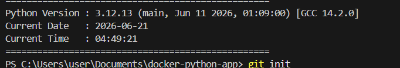

# Dockerized Python Application

This project demonstrates a simple Dockerized Python application using the official Python 3.12 Slim image.

## Project Structure

```text
docker-python-app/
│
├── app.py
├── Dockerfile
├── requirements.txt
└── README.md
```

## Application Output

The application displays:

- Python version running inside the container
- Current date
- Current time

## Build Docker Image

```bash
docker build -t docker-python-app .
```

## Run Docker Container

```bash
docker run --rm docker-python-app
```

## Sample Output

```text
==================================================
Python Version : 3.12.x
Current Date   : 2026-06-21
Current Time   : 10:30:15
==================================================
```

## GitHub Repository

Push the project to GitHub:

```bash
git init
git add .
git commit -m "Initial commit"

git branch -M main

git remote add origin <YOUR_GITHUB_REPOSITORY_URL>

git push -u origin main
```

## Screenshot

After running the container, take a screenshot of the terminal output and save it in the repository.

Example:

```text
screenshots/output.png
```

Then add it to README:

